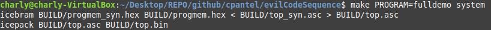

# Adaptación de icicle a EDU-CIAA-FPGA

El ataque cambio de comportamiento en un programa al detectar una secuencia de código, al cuál debe el nombre este repositorio, está en https://github.com/cpantel/evilCodeSequence/tree/attack_detect_code_ok_undetectable

Más detalles en:

https://seguridad-agile.blogspot.com/2021/09/h4ck3d-2021-configuracion-basica.html

https://seguridad-agile.blogspot.com/2021/09/h4ck3d-2021-leyendo-los-botones-de-la.html

https://seguridad-agile.blogspot.com/2021/09/h4ck3d-2021-un-desvio-necesario.html

https://seguridad-agile.blogspot.com/2021/09/h4ck3d-2021-un-desvio-innecesario.html

https://seguridad-agile.blogspot.com/2021/10/h4ck3d-2021-sigue-el-desvio-para-bien.html

https://seguridad-agile.blogspot.com/2021/10/h4ck3d-2021-cambios-al-makefile.html

https://seguridad-agile.blogspot.com/2021/10/h4ck3d-2021-mejor-resolucion-de.html

https://seguridad-agile.blogspot.com/2021/11/h4ck3d-2021-el-escenario-y-el-programa.html

https://seguridad-agile.blogspot.com/2021/11/h4ck3d-2021-el-ataque-concreto.html


## Falta revisión

Instrucciones específicas para [EDU-FPGA](http://www.proyecto-ciaa.com.ar/devwiki/doku.php?id=desarrollo%3Aedu-fpga):

## Instalación nativa de las herramientas

Estos pasos fueron probados con `Linux Mint 21 Mate` en un sistema de 64-bits `x86_64`.

### Dependencias

- Instalar dependencias disponibles en el repositorio.

```
sudo apt update
sudo apt install gperf build-essential cmake python3-dev texinfo vim libboost-all-dev tcl-dev libreadline-dev libffi-dev libeigen3-dev

```

- Crear un directorio de trabajo y posicionarse en él.
```
mkdir -p ~/workspace/
cd ~/workspace/
```

#### Permisos

Tal como está, hace falta root para instalar, de querer instalar como usuario común, ver para cada proyecto la opción de ruta de instalación.

Para que `iceprog` pueda acceder a la placa, puede hacer falta:
 
```
echo 'ACTION=="add", ATTR{idVendor}=="0403", ATTR{idProduct}=="6010", MODE:="666"' |\
sudo tee -a /etc/udev/rules.d/70-lattice.rules 1>/dev/null
sudo service udev restart
```

### Toolchain RISC-V

Clonar y construir el toolchain para `RV32I`.

**NOTA**: Este repositorio es grande (~7GB). Clonarlo y luego construirlo lleva tiempo, ¡paciencia!

```
cd ~/workspace/
git clone --recursive https://github.com/riscv/riscv-gnu-toolchain
cd riscv-gnu-toolchain

./configure --enable-multilib
sudo make # compila e instala en una o dos horas en VM i5 dual core...
```

### Icarus Verilog

```
cd ~/workspace/
git clone git://github.com/steveicarus/iverilog.git
cd iverilog
sh autoconf.sh
./configure
make
sudo make install
```

### IceStorm

```
cd ~/workspace/
git clone https://github.com/YosysHQ/icestorm.git icestorm
cd icestorm
make -j$(nproc)
sudo make install
```

### NextPNR

```
cd ~/workspace/
git clone https://github.com/YosysHQ/nextpnr nextpnr --recursive
cd nextpnr
cmake -DARCH=ice40 -DCMAKE_INSTALL_PREFIX=/usr/local .
make -j$(nproc)
sudo make install
```

### Yosys

```
cd ~/workspace/
git clone https://github.com/YosysHQ/yosys.git yosys
cd yosys
make config-gcc
make -j$(nproc)
sudo make install
```


## Generación del bitstream


- Clonar repositorio, construir y grabar memoria de la EDU-FPGA:
```
cd ~/workspace/
git clone https://github.com/cpantel/evilCodeSequence.git
cd evilCodeSequence
# esto construirá el programa demofull
make software hardware system
# antes de ejecutar el siguiente comando, conectar la EDU-FPGA a la PC
make flash
```

Así se ve la salida típica de estos comandos:





¡Listo! Si conectaras unos switches al PMOD1, unos leds al PMOD0, un servo y unos leds al conector Arduino, verías...

Para compilar y desplegar otros programas:

```
make PROGRAM=rtc2uart
```

### Conexión en Virtual Box

No te olvides de conectar a la virtual:

Devices -> USB -> FTDI Dual RS232-HS[0700]

## TODO

  - Terminar de hacer funcionar K.I.T.T. 
  - Diseñar e implementar **sequencer**
  - Agregar lo que verías al paso anterior
  - Agregar diagrama e imagen con el conexionado para **fulldemo**
  - Orquestar mejor los readme legacy
  - Agregar diagrama de toolchain
  - Explicar como funciona 
  - Explicar la evolución
  - Señalar que el ataque está en su propio branch 
